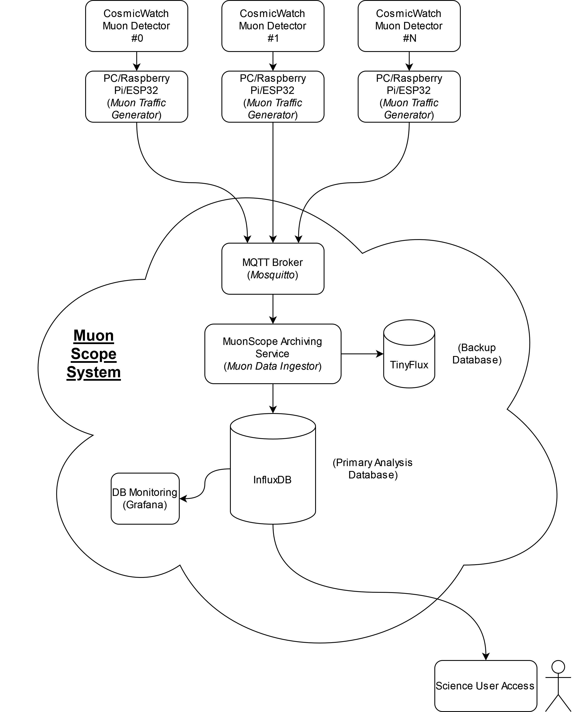

# MuonScope
Proof of concept user tools for the MuonScope project.

This repo contains each component as a submodule, to clone the full repo please clone as below:
```bash
git clone --recurse-submodules https://github.com/m0zjo-code/MuonScope.git
```


